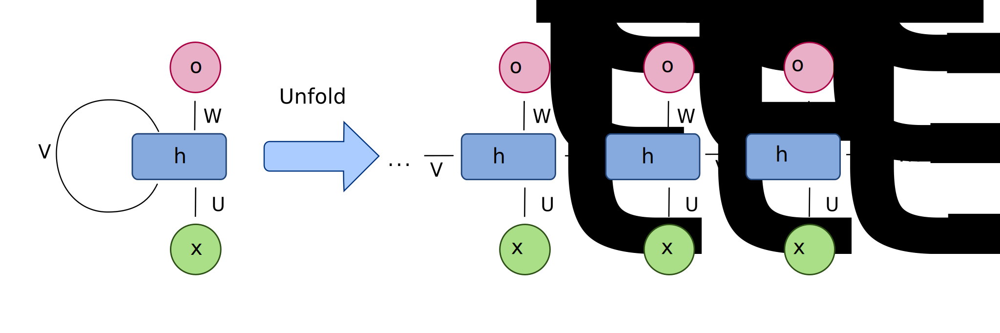

```{r setup, include=FALSE}
knitr::opts_chunk$set(
	message = FALSE,
	warning = FALSE,
	collapse = TRUE,
	cache = TRUE
)
```


# Introduction

Just how good is machine learning at predicting the future? Leaving aside objectively hard problems involving dynamical systems (weather, stock markets etc.), what I am really interested in is the ability of deep learning to predict what will happen to my patients.

Imagine this situation. You're seeing a patient with seropositive rheumatoid arthritis in clinic. They are currently on adalimumab 40mg every 2nd week and methotrexate 15mg weekly with folic acid. They have recently come off a course of prednisolone for a mild flare of their disease, but at the current visit they are in remission. Everything currently seems stable, you're happy to see them in 3 months with the usual blood tests. But what if I were to tell you that, in 3 months time, there is a 90% probability that this patient will be experiencing a flare of their disease? Would that change what you do today? Would that change the timing of their next appointment?

Currently, we don't yet have an evidence-based answer for how you should answer the above question, but that's partly because we don't have predictive tools that can tell us this probability with any great degree of accuracy.

[Norgeot and colleagues](https://jamanetwork.com/journals/jamanetworkopen/fullarticle/2728001) have attempted to create such a tool for rheumatoid arthritis. They have, in their own words, asked the question of whether "artificial intelligence models \[can\] prognosticate future patient outcomes for a complex disease, such as rheumatoid arthritis?" But they actually asked one further and very **crucial** question: *does such a model generalise to other cohorts?*

I'm going to cover four topics in this post:

1.  What was their study design?
2.  What was their model? (RNN)
3.  How to implement their model in R
4.  How did they test it on a different cohort? (Transfer Learning)

------------------------------------------------------------------------

# Study Design

Patients were selected from rheumatology clinics at two centres, UCSF hospital (UH) and Zuckerberg San Francisco General Hospital (SNH). The algorithm was initially trained on data from UCSF and subsequently tested on the ZH cohort using a concept called transfer learning (we will discuss this later).

## Patients

**Patients** had to meet the following criteria:

-   At least two rheumatoid arthritis ICD codes
-   The prescription of a [disease modifying anti-rheumatic drug (DMARD)](https://www.arthritis.org/living-with-arthritis/treatments/medication/drug-types/disease-modifying-drugs/drug-guide-dmards.php)
-   At least two recorded clinical disease activity index (CDAI) scores
-   At least one recorded C-reactive protein (CRP) level or erythrocyte sedimentation rate (ESR)

In total, 578 UH patients and 242 SNH patients were included.

## Outcome variable

The **outcome** they were trying to predict was a dichotomisation of the CDAI:

-   Controlled (CDAI≤10); or
-   Uncontrolled (CDAI>10)

## Covariates

**Variables** were:

-   Clinical (previous CDAI score)
-   Time-varying laboratory results (ESR and CRP)
-   Static laboratory results (rheumatoid factor, anticyclic citrullinated peptides)
-   Medication (DMARDs, glucocorticoids)
-   Demographic (age, sex, ethnicity)

The authors aren't explicit in their manuscript, but I think this quote suggests that they used four visits as lead-in data and predicted the CDAI at the fifth visit:^\[Under the section heading ["Variables Used in the Model"](https://jamanetwork.com/journals/jamanetworkopen/fullarticle/2728001):

> Considering each variable at each of 4 different time windows resulted in a reasonably large total time-dependent variable space of 165 variables

# Recurrent Neural (RNNs)

For a long time (relatively speaking), recurrent neural networks have been the building blocks of a time-series deep learning model. There are several variants, but they all share the same basic principle.



In this diagram, <i>h</i> is one recurrent neuron, receiving inputs from the features x<sub>1</sub>, x<sub>2</sub>, ... , x<sub>t</sub>, x<sub>t+1</sub>. Here, the subscript <i>t</i> is some sort of description of relative position - either time in the case of a time-series analysis, or position of a word in sentence when using these networks to model language.

In the paper we're discussing, these features are things like C-reactive Protein (CRP), the swollen joint count and prednisolone dose. So we can imagine, for example, that *x* is the CRP and therefore these features the the CRP values at particular clinic visits. Each of these features has its own node within the recurrent neuron, known as the hidden state. The important thing here, and the feature that makes it a recurrent neural network, is that the hidden states themselves are linked via a "memory" gate (*V*). This connection between time points allows the model to learn features such as periodicity and trends.

In this paper, the authors have used a particular type of RNN called a Gated Recurrent Unit (GRU).

Side note: there are two important historical problems with RNNs called the vanishing and exploding gradient problems. A note entirely explanation of this problem is this: the memory gate is a multiplier, with

------------------------------------------------------------------------

# Implementation

This paper comes with code, available from their [gitub repository](https://github.com/beaunorgeot/deep_clinical_forecasting). That is an exciting thing. They built their model in python, using [keras](keras.io), a popular API for building neural networks, particularly on top of Google's deep learning software library, [TensorFlow](www.tensorflow.org).

I have translated their code into the [{torch}](https://torch.mlverse.org/) package for R.

## Step 1: Load packages

```{r load packages, message=FALSE, warning=FALSE}
library(tidyverse)
library(tidymodels)
library(torch)
library(luz)
```

## Step 2: Load the data

I have made some simulation data of 100 patients with 10 visits each. For simplicity, I have not included DMARDs. The data here is mildly realistic only. Here is a small sample:

```{r}
toy_data <- readRDS("toy_data.rds") %>% 
  mutate(female = ifelse(sex == "Female", 1, 0))
```

```{r echo=FALSE, message=FALSE, warning=FALSE, paged.print=TRUE}
kableExtra::kable(head(toy_data, 100), "html") %>% 
  kableExtra::kable_styling(position = "center",  bootstrap_options = "striped", font_size = 14) %>% 
  kableExtra::scroll_box(height = "200px")
```

We will split into train and test sets.

To use this in a multivariable RNN, the data needs to be in two variables:

-   A 3D array of input features, of shape \[samples, time steps, features\]
-   A 1D array of outcomes

These will then be placed into dataloaders, so the data can be fed into the model in batches (here we're feeding in 100 samples at a time).

```{r}
ids <- toy_data %>% 
  select(patient_id) %>% 
  distinct() %>% 
  rowwise() %>% 
  mutate(rand = runif(1)) %>% 
  mutate(group = case_when(rand >= 0.85 ~ "Valid", 
                           rand >= 0.7 ~ "Test", 
                           TRUE ~ "Train"))
train_ids <- ids %>% filter(group == "Train") %>% pull(patient_id)
valid_ids <- ids %>% filter(group == "Valid") %>% pull(patient_id)
test_ids <- ids %>% filter(group == "Test") %>% pull(patient_id)

toy_dataset <- dataset(
  name = "toy_dataset",
  
  initialize = function(
    x,
    ids,
    n_timesteps = 10, 
    pred_window = 4) {
    
    self$x <- x %>% 
      filter(patient_id %in% ids)
    self$pred_window <- pred_window
    starting_n <- self$x %>% 
      mutate(row = row_number()) %>% 
      filter(visit_number < 7) %>% 
      pull(row)
    self$starts <- sample(starting_n)
    self$len <- length(self$starts)
    
  },
  
  .getitem = function(i) {
    
    start <- self$starts[i]
    end <- start + self$pred_window - 1
    
    x <- self$x %>% 
      select(age, acpa, rheum_factor, CDAI, female,
             ESR, CRP, pnl) %>% 
      slice(start:end) %>% 
      as.matrix()
    
    y <- self$x %>% 
      slice(end+1) %>% 
      pull(disease_control)
    
    list(x, y)
    
  },
  
  .length = function() {
    self$len
  }
)

train_dset <- toy_dataset(toy_data, ids = train_ids)
test_dset <- toy_dataset(toy_data, ids = test_ids)
valid_dset <- toy_dataset(toy_data, ids = valid_ids)
train_dl <- train_dset %>% dataloader(batch_size = 100, shuffle = TRUE)
test_dl <- test_dset %>% dataloader(batch_size = 100, shuffle = FALSE)
valid_dl <- valid_dset %>% dataloader(batch_size = 100, shuffle = FALSE)
```

## Step 3: Create the model function

This function, creatively named `model`, takes five parameters: the type of recurrent layer ("gru" or "lstm"), the input size of our data (number of variables), desired dimensions of the recurrent layer (`hidden_size`), the number of recurrent layers and the dropout fraction.

```{r}
model <- nn_module(
  
  initialize = function(
    type, 
    input_size, 
    hidden_size, 
    num_layers = 1, 
    dropout = 0,
    load_from = NA,
    freeze_params = NA) {
    
    if (!is.na(load_from)){
      saved_model <- torch::torch_load(load_from)
      self$load_state_dict(saved_model$state_dict())
    }
    
    if (!is.na(freeze_params)){
      self$freeze_weights(freeze_params)
    }
    
    self$type <- type
    self$num_layers <- num_layers
    
    
    self$rnn <- if (self$type == "gru") {
      nn_gru(
        input_size = input_size,
        hidden_size = hidden_size,
        num_layers = num_layers,
        dropout = dropout,
        batch_first = TRUE
      )
    } else {
      nn_lstm(
        input_size = input_size,
        hidden_size = hidden_size,
        num_layers = num_layers,
        dropout = dropout,
        batch_first = TRUE
      )
    }
    
    half_size <- round(hidden_size / 2)
    
    self$mod_list <- nn_module_list(
      list(
        nn_dropout(dropout),
        nn_linear(hidden_size, half_size),
        nn_dropout(dropout),
        nn_linear(half_size, 1)
      )
    )
    
  },
  
  forward = function(batch) {
    
    x <- self$rnn(batch)[[1]] # (batch_size, n_timesteps, hidden_size)
    x <- x[ , dim(x)[2], ] # (batch_size, hidden_size)
    
    for (i in 1:length(self$mod_list)){
      x <- self$mod_list[[i]](x)
    }
    x[,1]
    
  },
  
  freeze_weights = function(regex){
    names <- names(self$parameters)
    names <- names[str_detect(names, regex)]
    for (name in names){
      self$parameters[[name]]$requires_grad_(FALSE)
    }
  }
  
)
```

## Step 4: Build the model

```{r}
model_setup <- model %>%
  setup(
    loss = nn_bce_with_logits_loss(),
    optimizer = optim_adam,
    metrics = list(
      luz_metric_binary_accuracy_with_logits(),
      luz_metric_binary_auroc(from_logits = TRUE)
    )
  ) %>%
  set_hparams(type = "gru", 
              input_size = 8, 
              hidden_size = 32, 
              num_layers = 2, 
              dropout = 0.1) %>%
  set_opt_hparams(lr = 0.01)
```

## Step 5: Train the model

```{r message=FALSE, warning=FALSE, results='hide'}
fitted <- fit(model_setup,
              train_dl, 
              epochs = 25, 
              valid_data = valid_dl, 
              verbose = FALSE)
```

```{r echo=FALSE, message=FALSE, warning=FALSE, results='hide'}
metrics <- get_metrics(fitted)
metrics %>% 
  mutate(metric = case_when(metric == "loss" ~ "Loss",
                            metric == "acc" ~ "Accuracy",
                            metric == "auc" ~ "AUC",
                            TRUE ~ NA_character_)) %>% 
  ggplot(aes(x = epoch, y = value, col = set)) + 
  geom_line() + 
  facet_wrap("metric", ncol = 1, scales = "free_y") +
  cowplot::theme_cowplot(font_size = 20)
```

We can save this model for future use.

```{r}
luz_save_model_weights(fitted, "initial_fit.RDS")
```

## Step 6: Evaluate the model

We can evaluate our model using the area under the receiver operating characteristic.

```{r}
metrics <- evaluate(fitted, test_dset)$records$metrics$valid[[1]]
truth <- factor(test_dset$.getitem(1:1008)[[2]], levels = c(1, 0))
predictions <- as_array(nnf_sigmoid(predict(fitted, test_dset)))
roc_data <- tibble(truth, predictions)
roc_curve <- roc_curve(roc_data, truth = truth, estimate = predictions)
autoplot(roc_curve)
```

The AUC is `r round(metrics$auc, digits = 2)` - this seems fairly good. But how would our model perform on new data?

Let's load a new dataset and again split into training and test sets.

```{r}
new_toy_data <- readRDS("new_toy_data.rds") %>% 
  mutate(female = ifelse(sex == "Female", 1, 0))

new_dset <- toy_dataset(new_toy_data, ids = unique(new_toy_data$patient_id))
new_dl <- as_dataloader(new_dset, batch_size = 100)
```

We have loaded our new dataset, which you is a lot smaller. We will test our model and see how it performs.

```{r}
metrics <- evaluate(fitted, new_dset)$records$metrics$valid[[1]]
truth <- factor(new_dset$.getitem(1:new_dset$.length())[[2]], levels = c(1, 0))
predictions <- as_array(nnf_sigmoid(predict(fitted, new_dset)))
roc_data <- tibble(truth, predictions)
roc_curve <- roc_curve(roc_data, truth = truth, estimate = predictions)
autoplot(roc_curve)
```

Oh no, the AUC is only `r round(metrics$auc, digits = 2)` - that's not great! How can we do better? Well, we can do what the authors of this paper did and perform transfer learning.

------------------------------------------------------------------------

# Transfer Learning

Transfer learning is the process of taking a model trained on one task and reapplying it to perform a new task, often with some re-training on the new task, although sometimes without. Generally, we perform transfer learning with models originally trained on large datasets and transfer those models to tasks using much smaller datasets. In doing so, we don't want to lose all of the hard-won information learnt from the large dataset, so re-training is generally performed on a subset of the model layers (the latter layers). We will perform transfer learning by freezing all layers, except the dense layers.

First, we will do a data split like earlier:

```{r}
ids <- new_toy_data %>% 
  select(patient_id) %>% 
  distinct() %>% 
  rowwise() %>% 
  mutate(rand = runif(1)) %>% 
  mutate(group = case_when(rand >= 0.8 ~ "Valid", 
                           rand >= 0.6 ~ "Test", 
                           TRUE ~ "Train"))
train_ids <- ids %>% filter(group == "Train") %>% pull(patient_id)
valid_ids <- ids %>% filter(group == "Valid") %>% pull(patient_id)
test_ids <- ids %>% filter(group == "Test") %>% pull(patient_id)

train_dset <- toy_dataset(new_toy_data, ids = train_ids)
test_dset <- toy_dataset(new_toy_data, ids = test_ids)
valid_dset <- toy_dataset(new_toy_data, ids = valid_ids)
train_dl <- train_dset %>% dataloader(batch_size = 100, shuffle = TRUE)
test_dl <- test_dset %>% dataloader(batch_size = 100, shuffle = FALSE)
valid_dl <- valid_dset %>% dataloader(batch_size = 100, shuffle = FALSE)
```

Now we will create a function to freeze the RNN:

```{r}
model_new <- model %>%
  setup(
    loss = nn_bce_with_logits_loss(),
    optimizer = optim_adam,
    metrics = list(
      luz_metric_binary_accuracy_with_logits(),
      luz_metric_binary_auroc(from_logits = TRUE)
    )
  ) %>%
  set_hparams(type = "gru", 
              input_size = 8, 
              hidden_size = 32, 
              num_layers = 2, 
              dropout = 0.1,
              load_from = "initial_fit.RDS",
              freeze_params = "rnn") %>%
  set_opt_hparams(lr = 0.01)
```

Now let's train the final deep layers:

```{r message=FALSE, warning=FALSE}
fitted_new <- fit(model_new,
                  train_dl, 
                  epochs = 25, 
                  valid_data = valid_dl, 
                  verbose = FALSE)
```

```{r echo=FALSE, message=FALSE, warning=FALSE, results='hide'}
metrics <- get_metrics(fitted_new)
metrics %>% 
  mutate(metric = case_when(metric == "loss" ~ "Loss",
                            metric == "acc" ~ "Accuracy",
                            metric == "auc" ~ "AUC",
                            TRUE ~ NA_character_)) %>% 
  ggplot(aes(x = epoch, y = value, col = set)) + 
  geom_line() + 
  facet_wrap("metric", ncol = 1, scales = "free_y") +
  cowplot::theme_cowplot(font_size = 20)
```

Looking now at the performance:

```{r}
metrics <- evaluate(fitted, test_dset)$records$metrics$valid[[1]]
truth <- factor(test_dset$.getitem(1:1008)[[2]], levels = c(1, 0))
predictions <- as_array(nnf_sigmoid(predict(fitted, test_dset)))
roc_data <- tibble(truth, predictions)
roc_curve <- roc_curve(roc_data, truth = truth, estimate = predictions)
autoplot(roc_curve)
```

The AUC has now risen to `r round(metrics$auc, digits = 2)` - a little bit better.

------------------------------------------------------------------------

# Wrapping Up

Predicting the future in rheumatoid arthritis may every well expand our horizons for optimal disease management. Pre-emptive management ought to be one of the cornerstones of treat-to-target strategies, and yet pre-emptive management is unattainable without accurate prediction models. Whilst machine learning offers an opportunity to build such models, the model we have explored here has some shortcomings. In particular, it remains a black box in terms of how it comes to its conclusions (*explain-ability*) and how certain it is of these conclusions (*confidence*).
